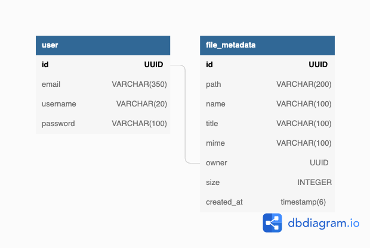
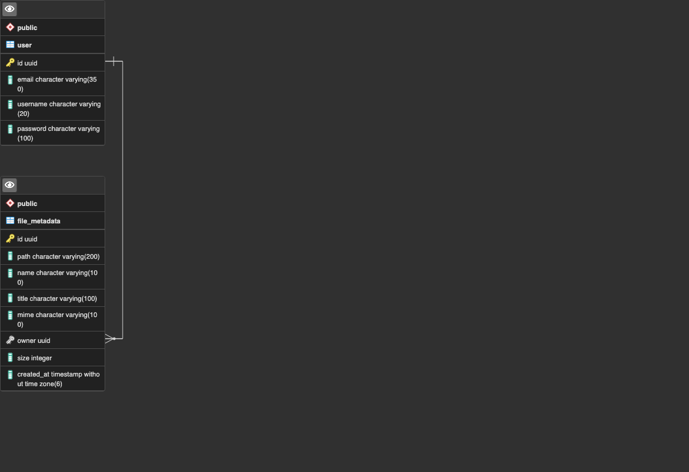

# Sire Client

Sire is a file sharing service. This README shows how to set it up using docker-compose.

## Purpose

This project was created as a project to familiarize myself with some important software engineering concepts. While it is not extremely complex in its functionality, the project has allowed me to familiarize myself with various software engineering concepts such as client-server architecture, docker, TDD (postman), sprints, and MVC architecture. The code is also written with readability, extensibility, and maintainability in mind. All code is also thoroughly tested.

To discover my other projects, please visit my portfolio.

## Project Structure

This project is broken up into 4 major parts.

- API (user registration, user authentication, file upload, file management, etc.) (available under /api folder)
- Client (client-facing service) (available under /client folder)
- CDN (delivers files to users)
- Docker (runs all above components in a network, together as a project) (available in the dockerfile)

**IMPORTANT**: READMEs for API and Client are available in their respective folders. Please visit those READMEs to learn more about those components.

## Components

API - Written using express, prisma, multer, jest, passport, and typescript.
Client - Written using nextjs, react, tailwindcss, and daisyUI, react query, axios.
CDN - Served by NGINX.
Container - Docker.

## Database

Sire uses postgres to store all user data and file information.

### Schema Diagram



### ER Diagram



## Setup & Installation

**NOTE**: It is recommended that you use docker to run this project unless you know what you are doing. The following steps will show how to run sire project using docker-compose.

### Requirements

```
docker
docker-compose
nginx
```

### Setup

Before starting, you must do the following:

- Populate an `.env` file in the `/api` folder.
- Populate an `.env.local` file in the `/client` folder.
- Create a folder where sire will store all uploaded files (this should match the UPLOAD_PATH provided in your .env file).

To learn more about which fields to populate, please visit the READMEs of the `/api` and `/client` components.

### Installation & Usage

Once you have populated the environment variables and have created a folder where sire will store files, you can install this project using docker by running the following commands in the root directory of this project.

```
docker-compose build
docker-compose run api npx prisma db push
```

You may then run this project in the background by using `docker-compose up -d`.

The API should now be running on: `localhost:8000`
The client should now be running on: `localhost:3000`
The DB should now be running on: `localhost:5432`
The redis cache should now be running on: `localhost:6379`

### Using Nginx to Serve Files

Without a server to serve static files, all stored files cannot be viewed by any user. To this end, nginx can be used as a CDN to serve all the uploaded content.

Assuming you have nginx installed, you can edit your `nginx.conf` file to match the following example:

```
user root;
worker_processes  auto;
pid /run/nginx.pid;

events {
    worker_connections  1024;
}

http {
    # This can also be /etc/nginx/mime.types depending on your install location
    include /etc/nginx/mime.types;
    server {
        listen       80;
        # Your domain name can be localhost
        server_name  <YOUR_DOMAIN_NAME>;

        location /api {
            proxy_pass http://localhost:8000;
        }

        location / {
            proxy_pass http://localhost:3000;
        }
    }
    server {
        listen 80;
        # Your domain name can be localhost
        server_name ~^(?<subdomain>.+)\.<YOUR_DOMAIN_NAME>;

        location / {
            # This should match the UPLOAD_PATH defined in your .env variable
            root /root/sire-uploads/$subdomain;
        }
    }
}
```
